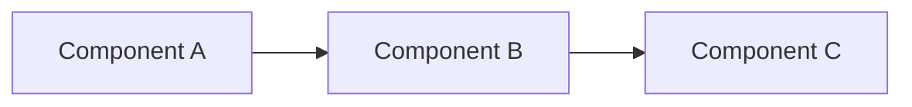

## 💡 Feature Description

A clear and concise description of the feature or pattern you'd like to see.

## 🎯 Problem to Solve

**What problem does this feature solve?**

Describe the pain point or challenge that this feature would address. Include:
- Current limitations
- Manual workarounds you're using
- Impact on your workflow

## 🏗️ Proposed Solution

**How would you implement this?**

Describe your proposed solution in detail:
- Architecture approach
- Key components
- Technologies involved
- Integration points

### Architecture Diagram (Optional)



## 🔄 Alternatives Considered

**What other approaches did you consider?**

- **Alternative 1**: Description and why you didn't choose it
- **Alternative 2**: Description and why you didn't choose it

## 📊 Use Cases

**Who would benefit from this feature?**

- **Use Case 1**: [e.g., "Data engineers processing real-time IoT data"]
- **Use Case 2**: [e.g., "Teams migrating from batch to streaming"]
- **Use Case 3**: [e.g., "Organizations with strict data governance requirements"]

## 🎯 Success Criteria

**How would we know this feature is successful?**

- [ ] Criterion 1: [e.g., "Reduces pipeline latency by 50%"]
- [ ] Criterion 2: [e.g., "Handles 1M+ events/sec"]
- [ ] Criterion 3: [e.g., "Easy to understand and implement"]

## 💻 Example Usage (Optional)

If you can, provide a code example of how you'd like to use this feature:

```python
# Example usage
from data_patterns import YourFeature

pipeline = YourFeature(
    config={
        "param1": "value1",
        "param2": "value2"
    }
)

result = pipeline.process()
```

## 📈 Expected Impact

**What would be the impact of this feature?**

- Performance improvement: [e.g., "10x faster processing"]
- Cost reduction: [e.g., "30% lower cloud costs"]
- Developer productivity: [e.g., "Save 5 hours per week"]
- Code quality: [e.g., "Reduce bugs by 40%"]

## 🔗 Related Patterns

Are there existing patterns this would complement or extend?

- [Related Pattern 1](link)
- [Related Pattern 2](link)

## 📚 References

Links to relevant documentation, blog posts, or examples:

- [Reference 1](link)
- [Reference 2](link)

## 🤝 Contribution

**Would you be willing to contribute this feature?**

- [ ] Yes, I can implement this
- [ ] Yes, I can help with documentation
- [ ] Yes, I can help with testing
- [ ] No, but I can provide guidance/review
- [ ] No, I'm just suggesting the idea

## ✔️ Checklist

- [ ] I have searched existing issues to ensure this is not a duplicate
- [ ] I have clearly described the problem and solution
- [ ] I have considered alternative approaches
- [ ] I have outlined the expected impact
- [ ] I have provided use cases or examples
