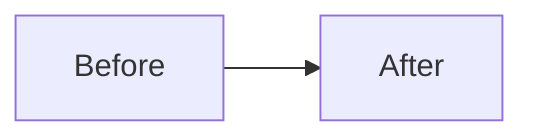

# Pull Request

## 📝 Description

<!-- Provide a clear and concise description of your changes -->

## 🎯 Type of Change

<!-- Mark the relevant option with an "x" -->

- [ ] 🐛 Bug fix (non-breaking change that fixes an issue)
- [ ] ✨ New feature (non-breaking change that adds functionality)
- [ ] 💥 Breaking change (fix or feature that would cause existing functionality to not work as expected)
- [ ] 📚 Documentation update
- [ ] 🎨 Code style update (formatting, renaming)
- [ ] ♻️ Refactoring (no functional changes)
- [ ] ⚡ Performance improvement
- [ ] ✅ Test update
- [ ] 🔧 Configuration change
- [ ] 🚀 New pattern/implementation

## 🔗 Related Issues

<!-- Link to related issues. Use "Fixes #123" to auto-close issues when PR is merged -->

- Fixes #
- Related to #

## 🏗️ What Changed?

### Core Changes
<!-- List the main changes in this PR -->

- Change 1
- Change 2
- Change 3

### Architecture Impact
<!-- If applicable, describe how this affects the overall architecture -->



## 📊 Performance Impact

<!-- If applicable, provide performance metrics -->

| Metric | Before | After | Change |
|--------|--------|-------|--------|
| Latency | X ms | Y ms | -Z% |
| Memory | X MB | Y MB | -Z% |
| Cost | $X | $Y | -Z% |

## 🧪 Testing

### Test Coverage
<!-- Describe the tests you added or updated -->

- [ ] Unit tests added/updated
- [ ] Integration tests added/updated
- [ ] Manual testing performed
- [ ] Performance tests conducted

### How to Test

```bash
# Steps to test this PR
1. Clone the branch
2. Run: pytest tests/test_feature.py
3. Verify: python examples/demo.py
```

### Test Results

<!-- Paste test results or screenshots -->

```
Test output here
```

## 📸 Screenshots / Diagrams

<!-- If applicable, add screenshots or diagrams -->

### Before
<!-- Screenshot or diagram of the old behavior -->

### After
<!-- Screenshot or diagram of the new behavior -->

## 🔒 Security Considerations

<!-- Address any security implications -->

- [ ] No hardcoded secrets or credentials
- [ ] Input validation added where needed
- [ ] Security best practices followed
- [ ] Dependencies checked for vulnerabilities

## 📚 Documentation

<!-- Mark completed items -->

- [ ] README updated
- [ ] Code comments added/updated
- [ ] Docstrings added/updated
- [ ] Architecture diagrams added/updated
- [ ] Examples provided
- [ ] Migration guide created (if breaking change)

## ✔️ Pre-Merge Checklist

<!-- Ensure all items are checked before requesting review -->

### Code Quality
- [ ] Code follows the style guidelines (Black, Pylint)
- [ ] Type hints added for all functions
- [ ] Google-style docstrings added
- [ ] Error handling implemented
- [ ] Logging added where appropriate

### Testing
- [ ] All new code is covered by tests
- [ ] All tests pass locally
- [ ] Integration tests pass
- [ ] Manual testing completed

### Documentation
- [ ] README updated with new features
- [ ] Code is well-commented
- [ ] Architecture diagrams included
- [ ] Examples provided

### Review
- [ ] Self-review completed
- [ ] No merge conflicts
- [ ] Commit messages are clear and descriptive
- [ ] Changes are backwards compatible (or migration guide provided)

## 💡 Implementation Notes

<!-- Add any additional context about the implementation -->

### Design Decisions
- Decision 1: Rationale
- Decision 2: Rationale

### Alternatives Considered
- Alternative 1: Why not chosen
- Alternative 2: Why not chosen

### Known Limitations
- Limitation 1: Explanation
- Limitation 2: Explanation

## 🚀 Deployment Notes

<!-- If applicable, add deployment instructions or considerations -->

- [ ] Database migrations required
- [ ] Configuration changes needed
- [ ] Infrastructure updates required
- [ ] Backwards compatibility maintained

### Rollback Plan
<!-- Describe how to rollback if something goes wrong -->

```bash
# Rollback steps
1. Step 1
2. Step 2
```

## 📖 Additional Context

<!-- Add any other context about the PR here -->

## 🎯 Reviewer Focus Areas

<!-- Guide reviewers on what to focus on -->

Please pay special attention to:
1. Area 1 (e.g., error handling in pipeline.py)
2. Area 2 (e.g., performance of data processing)
3. Area 3 (e.g., security implications)

## 📝 Post-Merge Tasks

<!-- List any tasks that need to be done after merging -->

- [ ] Update CHANGELOG.md
- [ ] Create release notes
- [ ] Update documentation site
- [ ] Announce in discussions
- [ ] Update project board

---

## 🙏 Acknowledgments

<!-- Credit anyone who helped with this PR -->

Thanks to @username for helping with...

---

**By submitting this PR, I confirm that:**
- [ ] My code follows the project's contributing guidelines
- [ ] I have performed a self-review of my code
- [ ] I have tested my changes thoroughly
- [ ] I have updated the documentation accordingly
- [ ] My changes generate no new warnings
- [ ] I agree to the MIT License for this contribution
