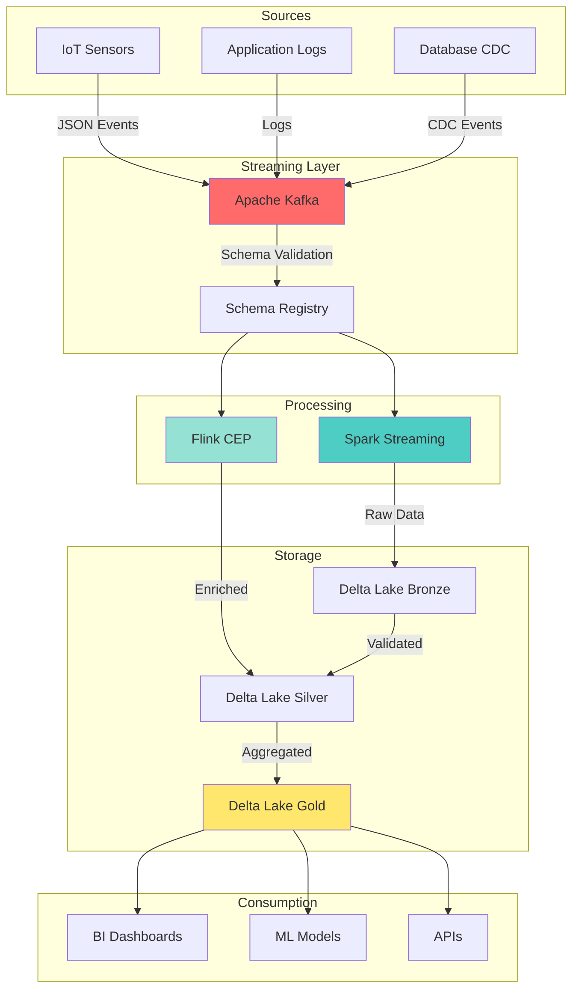

# 🚀 Real-Time Streaming Patterns

Production-grade patterns for building reliable, scalable streaming data pipelines.


## 📋 Overview

This section contains battle-tested patterns for real-time data streaming using **Apache Kafka**, **Apache Flink**, and **Spark Structured Streaming**. These patterns have been deployed in production environments processing millions of events daily.

## 🎯 What You'll Learn

- ✅ Exactly-once processing semantics
- ✅ Schema evolution in streaming pipelines
- ✅ Handling late-arriving data with watermarks
- ✅ Complex Event Processing (CEP) patterns
- ✅ Stateful stream processing
- ✅ Error handling & retry strategies
- ✅ Performance tuning for sub-minute latency

## 🗂️ Patterns Included

### 1. [Kafka → Delta Lake](kafka-to-delta-lake/) 🔴 Advanced

**Problem**: Ingest high-volume streaming data from Kafka into Delta Lake with schema validation and exactly-once guarantees.

**Tech Stack**: Kafka, Spark Structured Streaming, Delta Lake, Schema Registry

**Key Features**:
- Exactly-once processing with checkpoints
- Automatic schema evolution
- Nested JSON preservation
- Performance: 100K+ events/sec

**When to Use**:
- Building lakehouse architectures
- Need ACID guarantees on streaming data
- Require time travel & audit capabilities

**When NOT to Use**:
- Sub-second latency requirements (use Flink)
- Simple append-only workloads (use basic Spark)

→ [View Pattern](kafka-to-delta-lake/)

---

### 2. [Flink Complex Event Processing](flink-complex-event/) 🔴 Advanced

**Problem**: Detect complex patterns in real-time data streams (e.g., equipment failure prediction, fraud detection).

**Tech Stack**: Apache Flink, Kafka, CEP Library, State Backend

**Key Features**:
- Pattern matching on event streams
- Temporal pattern detection
- Sub-second latency
- Stateful event processing

**When to Use**:
- Pattern detection (e.g., A followed by B within 5 minutes)
- Real-time anomaly detection
- Session windowing
- Ultra-low latency requirements (<1 sec)

**When NOT to Use**:
- Simple filtering/aggregation (use Spark)
- Batch processing (use Spark)
- No complex pattern matching needed

→ [View Pattern](flink-complex-event/)

---

### 3. [Spark Structured Streaming](spark-structured-streaming/) 🟡 Intermediate

**Problem**: Build unified batch/streaming pipelines with advanced watermarking and windowing.

**Tech Stack**: Spark Structured Streaming, Kafka, Delta Lake

**Key Features**:
- Unified API for batch & streaming
- Advanced watermarking strategies
- Multiple streaming aggregations
- Trigger configurations

**When to Use**:
- Need unified batch/stream code
- Complex aggregations & joins
- Integration with Spark ecosystem
- Processing latency: 10s - 2min acceptable

**When NOT to Use**:
- Sub-second latency needed (use Flink)
- Simple CDC replication (use Debezium)

→ [View Pattern](spark-structured-streaming/)

---

## 🏗️ Architecture Overview



## 📊 Performance Comparison

| Pattern | Latency | Throughput | Complexity | Use Case |
|---------|---------|------------|------------|----------|
| **Kafka → Delta Lake** | 30-60s | 100K+ events/sec | Medium | Lakehouse ingestion |
| **Flink CEP** | <1s | 50K+ events/sec | High | Pattern detection |
| **Spark Streaming** | 10-120s | 200K+ events/sec | Medium | Aggregations |

## 🚀 Quick Start

### Prerequisites

```bash
# Required tools
- Docker & Docker Compose
- Python 3.9+
- Apache Spark 3.5+
- JDK 11 or 17
```

### Launch Demo Environment

```bash
# Start Kafka + Zookeeper + Schema Registry
cd 01-streaming-realtime/kafka-to-delta-lake
docker-compose up -d

# Verify services
docker-compose ps

# Run streaming pipeline
python run_pipeline.py --mode streaming --topic sensor-events
```

## 🎓 Learning Path

1. **Start Here**: [Spark Structured Streaming](spark-structured-streaming/) - Fundamental concepts
2. **Next**: [Kafka → Delta Lake](kafka-to-delta-lake/) - Production patterns
3. **Advanced**: [Flink CEP](flink-complex-event/) - Complex event processing

## 📈 Real-World Results

### Manufacturing IoT Pipeline
- **Scale**: 5M events/day from 200+ machines
- **Latency**: 45 seconds end-to-end (sensor → dashboard)
- **Reliability**: 99.9% uptime over 18 months
- **Cost**: $2K/month cloud infrastructure

### E-commerce Clickstream
- **Scale**: 10M events/day
- **Latency**: <5 seconds for real-time recommendations
- **Patterns**: Session analysis, cart abandonment detection

## 🔧 Common Pitfalls & Solutions

### ❌ Problem: Memory Issues with Large State
**Solution**: Use RocksDB state backend, configure TTL for state cleanup

### ❌ Problem: Late Data Causing Incorrect Results
**Solution**: Implement watermarking with allowedLateness configuration

### ❌ Problem: Slow Kafka Consumer Lag
**Solution**: Increase parallelism, optimize batch sizes, enable compression

### ❌ Problem: Schema Conflicts Breaking Pipeline
**Solution**: Use Schema Registry with compatibility modes, implement schema evolution

## 🛠️ Troubleshooting Guide

| Issue | Symptoms | Solution |
|-------|----------|----------|
| High lag | Consumer offset falling behind | Increase partitions, scale consumers |
| OOM errors | Executor failures | Tune memory, reduce batch size |
| Checkpoint failures | Restarts from beginning | Fix checkpoint location, verify permissions |
| Data loss | Missing records | Verify exactly-once config, check offsets |

## 📚 Related Documentation

- [Performance Tuning Guide](../docs/PERFORMANCE_TUNING.md)
- [Schema Evolution Strategies](../03-data-architecture/schema-evolution-strategies/)
- [Monitoring & Alerting](../06-monitoring-observability/)
- [Testing Streaming Pipelines](../09-testing-strategies/)

## 🤝 Contributing

Have a streaming pattern to share? See [CONTRIBUTING.md](../CONTRIBUTING.md)

---

**Next Steps**: Explore [Batch Processing Patterns →](../02-batch-processing/)
