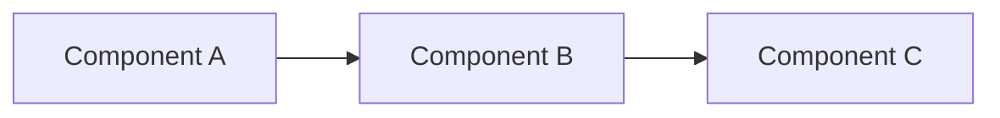

# Contributing to Data Engineering Patterns

First off, thank you for considering contributing to this project! 🎉

This repository is built by data engineers, for data engineers. Your contributions help make production-grade patterns accessible to everyone.

## 🌟 How Can I Contribute?

### 1. Share Your Battle-Tested Patterns

Have a production pattern that solved a real problem? We'd love to include it!

**What makes a great pattern contribution:**
- ✅ Deployed in production
- ✅ Solves a specific, common problem
- ✅ Includes working code examples
- ✅ Has clear documentation
- ✅ Provides before/after metrics when possible

### 2. Improve Existing Documentation

Found something unclear or outdated? Help make it better:
- Fix typos and grammar
- Add more examples
- Improve diagrams
- Update deprecated code
- Add troubleshooting tips

### 3. Report Issues

Encountered a bug or problem? Let us know:
- Check if the issue already exists
- Use the issue templates
- Provide clear reproduction steps
- Include environment details

### 4. Suggest New Patterns

Have an idea for a pattern that should be here?
- Open a feature request
- Describe the problem it solves
- Outline the proposed solution
- Reference any relevant resources

---

## 🚀 Getting Started

### Prerequisites

- Python 3.9+
- Docker Desktop
- Git
- Basic knowledge of data engineering concepts

### Development Setup

```bash
# Fork and clone the repository
git clone https://github.com/YOUR_USERNAME/data-engineering-patterns.git
cd data-engineering-patterns

# Create a virtual environment
python -m venv venv
source venv/bin/activate  # On Windows: venv\Scripts\activate

# Install development dependencies
pip install -r requirements-dev.txt

# Install pre-commit hooks
pre-commit install
```

---

## 📝 Contribution Guidelines

### Code Style

All code must follow these standards:

1. **Python Code**:
   - Use Black for formatting (line length: 100)
   - Follow PEP 8 guidelines
   - Include type hints (Python 3.9+)
   - Write Google-style docstrings
   - Add comprehensive error handling

2. **Documentation**:
   - Use clear, concise language
   - Include Mermaid diagrams for architecture
   - Add code examples with comments
   - Provide "When to use" and "When NOT to use" sections

3. **Testing**:
   - Write unit tests for all functions
   - Aim for >80% code coverage
   - Include integration tests where applicable
   - Use pytest for testing

### Code Example Template

```python
from typing import Dict, List, Optional
from pyspark.sql import DataFrame, SparkSession
import logging

logger = logging.getLogger(__name__)


def your_function(
    spark: SparkSession,
    input_path: str,
    output_path: str,
    options: Optional[Dict[str, str]] = None
) -> DataFrame:
    """
    Brief description of what the function does.

    This function demonstrates [key concept]. It handles [specific scenario]
    by implementing [solution approach].

    Args:
        spark: Active Spark session
        input_path: Path to input data
        output_path: Path for output data
        options: Optional configuration dictionary

    Returns:
        Processed DataFrame

    Raises:
        ValueError: If input_path is invalid
        RuntimeError: If processing fails

    Example:
        >>> df = your_function(
        ...     spark=spark,
        ...     input_path="s3://bucket/input",
        ...     output_path="s3://bucket/output"
        ... )
        >>> df.show()

    Note:
        This pattern is most effective when dealing with [scenario].
        For alternative approaches, see [related pattern].
    """
    try:
        logger.info(f"Processing data from {input_path}")

        # Your implementation here
        df = spark.read.parquet(input_path)

        # Process data
        result = df.filter("condition")

        # Write output
        result.write.mode("overwrite").parquet(output_path)

        logger.info(f"Successfully processed {result.count()} records")
        return result

    except Exception as e:
        logger.error(f"Processing failed: {e}")
        raise RuntimeError(f"Failed to process data: {e}")
```

---

## 📁 Pattern Structure

When adding a new pattern, follow this structure:

```
pattern-name/
├── README.md                 # Main documentation
├── src/
│   ├── __init__.py
│   ├── pipeline.py          # Main implementation
│   ├── config.py            # Configuration
│   └── utils.py             # Helper functions
├── tests/
│   ├── __init__.py
│   ├── test_pipeline.py
│   └── test_utils.py
├── notebooks/
│   └── demo.ipynb           # Interactive demo
├── docker/
│   └── docker-compose.yml   # Local environment
├── diagrams/
│   └── architecture.mmd     # Mermaid diagrams
└── examples/
    └── example_usage.py     # Usage examples
```

### README Template for Patterns

```markdown
# Pattern Name

## 🎯 Problem Statement

Clear description of the problem this pattern solves.

**Symptoms:**
- Issue 1
- Issue 2

**Why this matters:**
Business or technical impact explanation.

---

## 🏗️ Architecture



---

## ⚡ Quick Start

\```bash
# Setup
docker-compose up -d

# Run the pattern
python src/pipeline.py --config config/production.yml
\```

---

## 💻 Implementation Details

### Core Components

1. **Component 1**: What it does
2. **Component 2**: What it does

### Key Design Decisions

**Decision 1**: Why we chose this approach
**Decision 2**: Tradeoffs considered

---

## 📊 Performance Metrics

| Metric | Before | After | Improvement |
|--------|--------|-------|-------------|
| Latency | 15 min | 30 sec | 30x faster |
| Cost | $500/day | $300/day | 40% reduction |

---

## ✅ When to Use

- Scenario 1
- Scenario 2

## ❌ When NOT to Use

- Scenario 1
- Scenario 2

---

## 🔗 Related Patterns

- [Related Pattern 1](../pattern-1/)
- [Related Pattern 2](../pattern-2/)

---

## 📚 Further Reading

- [Resource 1](link)
- [Resource 2](link)

---

## 🤝 Contributing

Found an improvement? See [CONTRIBUTING.md](../../CONTRIBUTING.md)
```

---

## 🔄 Pull Request Process

1. **Create a Feature Branch**
   ```bash
   git checkout -b feature/your-pattern-name
   ```

2. **Make Your Changes**
   - Follow the code style guidelines
   - Add tests for new functionality
   - Update documentation

3. **Test Your Changes**
   ```bash
   # Run tests
   pytest tests/

   # Check code quality
   black --check .
   pylint src/
   mypy src/
   ```

4. **Commit Your Changes**
   ```bash
   git add .
   git commit -m "feat: add [pattern name] implementation

   - Add core implementation
   - Include unit tests
   - Add documentation
   "
   ```

5. **Push and Create PR**
   ```bash
   git push origin feature/your-pattern-name
   ```
   - Use the PR template
   - Link related issues
   - Add screenshots/diagrams
   - Request review

6. **Address Review Comments**
   - Respond to all feedback
   - Make requested changes
   - Update tests if needed

7. **Merge**
   - Squash commits for clean history
   - Update CHANGELOG.md
   - Delete feature branch after merge

---

## 📋 PR Checklist

Before submitting your PR, ensure:

- [ ] Code follows style guidelines
- [ ] All tests pass
- [ ] Added tests for new functionality
- [ ] Documentation is updated
- [ ] Commit messages are clear
- [ ] No merge conflicts
- [ ] Diagrams are included (if applicable)
- [ ] Performance impact is documented
- [ ] Security considerations are addressed

---

## 🐛 Bug Reports

Use this template for bug reports:

**Describe the bug**
Clear description of what the bug is.

**To Reproduce**
Steps to reproduce:
1. Go to '...'
2. Run '...'
3. See error

**Expected behavior**
What you expected to happen.

**Environment:**
- OS: [e.g., Ubuntu 22.04]
- Python version: [e.g., 3.9.7]
- Spark version: [e.g., 3.4.0]
- Cloud provider: [e.g., Azure]

**Additional context**
Any other relevant information.

---

## 💡 Feature Requests

Use this template for feature requests:

**Problem to Solve**
What problem would this feature solve?

**Proposed Solution**
How would you implement this?

**Alternatives Considered**
What other approaches did you consider?

**Additional Context**
Any other relevant information.

---

## 🎓 First Time Contributors

Welcome! Here are some good first issues to get started:

- Documentation improvements
- Adding examples
- Writing tests
- Fixing typos
- Improving error messages

Look for issues labeled `good-first-issue` or `help-wanted`.

---

## 💬 Community Guidelines

### Be Respectful
- Use welcoming and inclusive language
- Respect differing viewpoints
- Accept constructive criticism gracefully
- Focus on what's best for the community

### Be Collaborative
- Help others learn
- Share knowledge generously
- Give credit where it's due
- Assume good intentions

### Be Professional
- Keep discussions on topic
- Provide constructive feedback
- Be patient with newcomers
- Follow the code of conduct

---

## 🏆 Recognition

Contributors will be:
- Added to the Contributors section
- Mentioned in release notes
- Featured in the README (for significant contributions)

---

## 📬 Questions?

- 💬 [Open a Discussion](https://github.com/mounish4882/data-engineering-patterns/discussions)
- 📧 Email: mounish4882@gmail.com
- 🐛 [Report an Issue](https://github.com/mounish4882/data-engineering-patterns/issues)

---

## 📄 License

By contributing, you agree that your contributions will be licensed under the MIT License.

---

<div align="center">

**Thank you for contributing! 🙏**

Every contribution, no matter how small, makes this project better.

</div>
