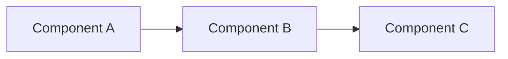

# Contributing to Data Engineering Patterns

Thank you for your interest in contributing! This repository is built on real-world production experience, and we welcome contributions that add value to the data engineering community.

## 🎯 What We're Looking For

### ✅ Great Contributions

- **Production Patterns**: Architectural patterns you've used in production
- **Troubleshooting Guides**: Solutions to problems you've actually solved
- **Performance Optimizations**: Techniques that improved real systems
- **Best Practices**: Lessons learned from production deployments
- **Documentation Improvements**: Making existing patterns clearer
- **Bug Fixes**: Correcting errors in code or documentation

### ❌ What We Don't Accept

- Theoretical patterns without production validation
- Company-specific proprietary code or sensitive data
- Patterns without clear documentation
- Breaking changes without discussion

## 🚀 How to Contribute

### 1. Before You Start

- Check existing [issues](../../issues) and [pull requests](../../pulls)
- Open an issue to discuss your idea first (for large changes)
- Read our [Code of Conduct](#code-of-conduct)

### 2. Development Workflow

```bash
# 1. Fork the repository
# Click "Fork" button on GitHub

# 2. Clone your fork
git clone https://github.com/YOUR_USERNAME/data-engineering-patterns.git
cd data-engineering-patterns

# 3. Create a feature branch
git checkout -b feature/my-awesome-pattern

# 4. Make your changes
# ... edit files ...

# 5. Test your changes
# Ensure all code examples work
# Run any relevant tests

# 6. Commit with clear messages
git add .
git commit -m "feat: add Spark optimization pattern for skewed joins

- Add detailed explanation of salting technique
- Include before/after performance metrics
- Add code examples with comments"

# 7. Push to your fork
git push origin feature/my-awesome-pattern

# 8. Create Pull Request
# Go to GitHub and click "New Pull Request"
```

### 3. Commit Message Guidelines

We follow [Conventional Commits](https://www.conventionalcommits.org/):

```
<type>: <description>

[optional body]

[optional footer]
```

**Types:**
- `feat`: New pattern or significant addition
- `fix`: Bug fix or correction
- `docs`: Documentation only changes
- `style`: Formatting, missing semicolons, etc.
- `refactor`: Code refactoring
- `test`: Adding tests
- `chore`: Maintenance tasks

**Examples:**
```
feat: add dimensional modeling pattern for manufacturing

- Add SCD Type 2 implementation
- Include example schemas
- Add best practices guide

docs: improve Kafka authentication troubleshooting guide

fix: correct typo in Delta Lake merge example

refactor: reorganize schema evolution patterns for clarity
```

## 📝 Contribution Standards

### Code Quality

**Python Code:**
```python
from typing import List, Dict, Optional
from pyspark.sql import DataFrame
import logging

logger = logging.getLogger(__name__)

def process_manufacturing_data(
    df: DataFrame,
    plant_ids: List[str],
    config: Optional[Dict] = None
) -> DataFrame:
    """
    Process manufacturing sensor data with validation.

    This function demonstrates best practices for:
    - Type hints for clarity
    - Comprehensive docstrings
    - Error handling
    - Logging

    Args:
        df: Input DataFrame with sensor readings
        plant_ids: List of plant IDs to filter
        config: Optional configuration dictionary

    Returns:
        Processed DataFrame with cleaned data

    Raises:
        ValueError: If plant_ids is empty

    Example:
        >>> df = process_manufacturing_data(
        ...     raw_df,
        ...     plant_ids=["PLANT_001", "PLANT_002"]
        ... )
    """
    if not plant_ids:
        raise ValueError("plant_ids cannot be empty")

    logger.info(f"Processing data for {len(plant_ids)} plants")

    # Your implementation
    processed_df = df.filter(col("plant_id").isin(plant_ids))

    return processed_df
```

**Standards:**
- ✅ Type hints (Python 3.10+)
- ✅ Google-style docstrings
- ✅ Error handling
- ✅ Logging where appropriate
- ✅ Code comments for complex logic
- ✅ 100-character line length max

### Documentation

**Pattern Structure:**

Every pattern should include:

```
pattern-name/
├── README.md              # Main documentation
├── src/                   # Code examples
│   └── example.py
├── examples/              # Working examples
│   └── usage_example.py
├── tests/                 # Tests (if applicable)
│   └── test_example.py
└── docs/                  # Additional documentation
    └── troubleshooting.md
```

**README Template:**

````markdown
# Pattern Name

## Problem Statement

Clear description of the problem this pattern solves.

## Solution Overview

High-level explanation of the approach.

## Architecture



## Implementation

### Prerequisites
- Requirement 1
- Requirement 2

### Code Example

```python
# Clear, working code example
```

### Configuration

Explain any configuration needed.

## When to Use

✅ **Use this pattern when:**
- Scenario 1
- Scenario 2

❌ **Don't use when:**
- Scenario 1
- Scenario 2

## Performance Considerations

Any performance implications or optimizations.

## Troubleshooting

Common issues and solutions.

## References

- [External resource 1](link)
- [External resource 2](link)
````

### No Sensitive Data

**❌ Never include:**
- Company-specific configurations
- Real production URLs, IPs, or hostnames
- Actual credentials (even expired ones)
- Proprietary business logic
- Real customer data
- Internal system architecture details

**✅ Instead use:**
- Generic examples: `example.com`, `plant-001`, `sensor-123`
- Placeholder credentials: `<your-username>`, `${SECRET_NAME}`
- Synthetic data: Generated test data
- Generic architectural patterns

**Example:**

```python
# ❌ Bad - Real company data
kafka_brokers = "prod-kafka-01.company-internal.com:9092"
username = "prod-svc-account"

# ✅ Good - Generic examples
kafka_brokers = "kafka-broker.example.com:9092"
username = "${KAFKA_USERNAME}"  # Retrieved from secrets manager
```

## 🧪 Testing

If contributing code:

```bash
# Run Python tests
pytest tests/ -v

# Check code style
black --check src/
pylint src/

# Type checking
mypy src/
```

## 📋 Pull Request Checklist

Before submitting your PR, ensure:

- [ ] Code follows style guidelines
- [ ] Documentation is clear and complete
- [ ] No sensitive/proprietary information included
- [ ] Examples use generic placeholders
- [ ] Commit messages follow conventions
- [ ] PR description explains the change
- [ ] Related issue is referenced (if applicable)
- [ ] All checks pass

## 🎨 PR Description Template

```markdown
## Description
Brief description of what this PR adds/fixes.

## Type of Change
- [ ] New pattern
- [ ] Bug fix
- [ ] Documentation improvement
- [ ] Performance optimization

## Motivation
Why is this change needed? What problem does it solve?

## Changes Made
- Change 1
- Change 2

## Testing
How was this tested?

## Related Issues
Fixes #123
Related to #456

## Screenshots (if applicable)
Add screenshots for UI/documentation changes.
```

## 🤝 Code of Conduct

### Our Standards

**Positive behavior:**
- Using welcoming and inclusive language
- Being respectful of differing viewpoints
- Gracefully accepting constructive criticism
- Focusing on what's best for the community
- Showing empathy towards others

**Unacceptable behavior:**
- Trolling, insulting/derogatory comments
- Personal or political attacks
- Public or private harassment
- Publishing others' private information
- Other conduct inappropriate in a professional setting

### Enforcement

Violations may result in:
1. Warning
2. Temporary ban
3. Permanent ban

Report issues to: [maintainer email]

## 💡 Tips for Great Contributions

### 1. Start Small

Your first contribution doesn't need to be a complete pattern. Consider:
- Fixing a typo
- Improving documentation
- Adding a code comment
- Reporting a bug

### 2. Provide Context

When adding a pattern:
- Explain the problem it solves
- Share real-world impact (if possible)
- Include before/after metrics
- Explain trade-offs

### 3. Make it Generic

Abstract away company-specific details:
- Use industry-standard terminology
- Generic examples (manufacturing, IoT, sensors)
- Placeholder names for systems
- Synthetic data for examples

### 4. Document Well

Good documentation includes:
- Clear problem statement
- Step-by-step implementation
- Code examples that work
- Troubleshooting section
- Links to external resources

## 🏆 Recognition

Contributors will be:
- Listed in repository contributors
- Mentioned in release notes
- Credited in pattern documentation

## 📞 Getting Help

- 💬 [GitHub Discussions](../../discussions) - Ask questions
- 🐛 [GitHub Issues](../../issues) - Report bugs
- 📧 Email maintainer: mounish4882@gmail.com

## 📄 License

By contributing, you agree that your contributions will be licensed under the MIT License.

---

## 🙏 Thank You!

Every contribution, no matter how small, makes this repository better for the entire data engineering community.

**Happy contributing!** 🚀
