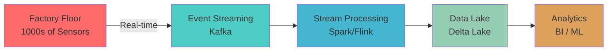

<div align="center">

# 🏭 Manufacturing Data Engineering Patterns

### *Production-Grade Architectures for Industrial IoT at Scale*

[](LICENSE)
[](https://linkedin.com/in/mounishravichandran)
[](https://github.com/mounish4882)

**Enterprise patterns for streaming data pipelines processing billions of manufacturing events**

[Overview](#-overview) • [Patterns](#-pattern-catalog) • [Tech Stack](#-technology-stack) • [Getting Started](#-getting-started) • [Contributing](#-contributing)

---

</div>

## 🎯 Overview

This repository documents **battle-tested data engineering patterns** for industrial manufacturing environments, where reliability, performance, and data quality are mission-critical.

### What You'll Find Here

**Real-world solutions** for common challenges in manufacturing data engineering:

- 🔐 **Secure streaming pipelines** with enterprise authentication
- 🔄 **Schema evolution strategies** for unpredictable IoT data
- ⚡ **Performance optimization** techniques for billion-record datasets
- 📊 **Dimensional modeling** patterns for manufacturing analytics
- 🚀 **Production deployment** with infrastructure-as-code
- 🔧 **Troubleshooting playbooks** for common production issues

### Why This Matters

Manufacturing data engineering has unique challenges:



**Challenges Solved:**
- ✅ Unpredictable schema changes from firmware updates
- ✅ High-velocity data streams (10K+ events/second)
- ✅ Multi-plant data conformance and integration
- ✅ Real-time quality monitoring with sub-minute latency
- ✅ Compliance and traceability requirements
- ✅ Cost optimization for cloud-scale deployments

---

## 🗂️ Pattern Catalog

### 1️⃣ Authentication & Security

**Production-grade security patterns for enterprise systems**

| Pattern | Description | Complexity |
|---------|-------------|------------|
| [Kafka SASL/SSL](01-authentication-security/kafka-sasl-ssl/) | Enterprise Kafka authentication with troubleshooting guide | 🔴 Advanced |
| [Secrets Management](01-authentication-security/secrets-management/) | Cloud secrets integration (Azure Key Vault, AWS Secrets Manager) | 🟡 Intermediate |

**Key Topics:** SASL mechanisms, certificate management, Databricks integration, auth failure debugging

---

### 2️⃣ Schema Evolution & Data Quality

**Handle unpredictable schema changes without pipeline failures**

| Pattern | Description | Complexity |
|---------|-------------|------------|
| [Delta Type Conflicts](02-schema-evolution/delta-type-conflicts/) | Resolve `DELTA_MERGE_INCOMPATIBLE_DATATYPE` errors | 🔴 Advanced |
| [MAP Type Flattening](02-schema-evolution/map-type-flattening/) | Progressive flattening strategy for dynamic schemas | 🔴 Advanced |
| [Schema Validation](02-schema-evolution/validation/) | Pre-merge schema compatibility checks | 🟡 Intermediate |

**Key Topics:** Type conflict resolution, dynamic key extraction, schema compatibility, backward compatibility

---

### 3️⃣ Streaming Architecture

**Real-time data pipelines with exactly-once semantics**

| Pattern | Description | Complexity |
|---------|-------------|------------|
| [Kafka → Delta Lake](03-streaming-architecture/kafka-to-delta/) | Medallion architecture for streaming data | 🔴 Advanced |
| [Kafka Streams + Spark](03-streaming-architecture/hybrid-architecture/) | Hybrid preprocessing and transformation pipeline | 🔴 Advanced |
| [Checkpointing Strategies](03-streaming-architecture/checkpointing/) | Fault-tolerant state management | 🟡 Intermediate |

**Key Topics:** Exactly-once semantics, watermarking, late data handling, backpressure management

---

### 4️⃣ Dimensional Modeling

**Star schema designs for manufacturing analytics**

| Pattern | Description | Complexity |
|---------|-------------|------------|
| [Manufacturing Star Schema](04-dimensional-modeling/star-schema/) | Complete dimensional model for factories | 🟡 Intermediate |
| [Slowly Changing Dimensions](04-dimensional-modeling/scd-patterns/) | SCD Type 1, 2, 3 implementations | 🟡 Intermediate |
| [Multi-Plant Hierarchies](04-dimensional-modeling/hierarchies/) | Cross-plant dimension conformance | 🔴 Advanced |

**Key Topics:** Fact tables, dimension tables, surrogate keys, historical tracking, aggregate facts

---

### 5️⃣ Performance Optimization

**Techniques for optimizing Spark pipelines at scale**

| Pattern | Description | Complexity |
|---------|-------------|------------|
| [Spark UI Analysis](05-performance-optimization/spark-ui-analysis/) | Methodology for identifying bottlenecks | 🟡 Intermediate |
| [Shuffle Optimization](05-performance-optimization/shuffle-optimization/) | Eliminate expensive shuffles | 🔴 Advanced |
| [Billion-Record Tuning](05-performance-optimization/billion-record-tuning/) | Configuration for massive datasets | 🔴 Advanced |

**Key Topics:** Stage analysis, skew detection, partition sizing, broadcast joins, AQE tuning

---

### 6️⃣ Deployment & Operations

**Infrastructure-as-code for production deployments**

| Pattern | Description | Complexity |
|---------|-------------|------------|
| [Databricks Bundles](06-deployment/databricks-bundles/) | Multi-environment deployment with CI/CD | 🟡 Intermediate |
| [GitHub Actions Pipeline](06-deployment/github-actions/) | Automated testing and deployment | 🟡 Intermediate |
| [Monitoring Setup](06-deployment/monitoring/) | Prometheus + Grafana dashboards | 🟡 Intermediate |

**Key Topics:** Asset bundles, environment promotion, automated testing, observability

---

### 7️⃣ Production Playbooks

**Troubleshooting guides for common production issues**

| Playbook | Description |
|----------|-------------|
| [Schema Evolution Errors](07-production-playbooks/schema-errors.md) | Fix `DELTA_MERGE_INCOMPATIBLE_DATATYPE` |
| [Kafka Auth Failures](07-production-playbooks/kafka-auth-failures.md) | Debug SASL/SSL authentication |
| [Performance Degradation](07-production-playbooks/performance-degradation.md) | Identify and fix slow pipelines |
| [Checkpoint Recovery](07-production-playbooks/checkpoint-recovery.md) | Recover from checkpoint failures |

---

## 🛠️ Technology Stack

<div align="center">

### Core Technologies

[](https://kafka.apache.org/)
[](https://spark.apache.org/)
[](https://delta.io/)
[](https://databricks.com/)

### Languages & Frameworks

[](https://python.org/)
[](https://spark.apache.org/docs/latest/api/python/)
[](https://www.java.com/)
[](https://www.postgresql.org/)

### Infrastructure & DevOps

[](https://docker.com/)
[](https://github.com/features/actions)
[](https://prometheus.io/)
[](https://grafana.com/)

</div>

---

## 🚀 Getting Started

### Prerequisites

- **Apache Kafka** 3.x+ (with SASL/SSL configured)
- **Apache Spark** 3.4+ or Databricks Runtime 13.x+
- **Delta Lake** 3.0+
- **Python** 3.10+
- **Java** 11+ (for Kafka Streams examples)

### Quick Examples

#### 1. Secure Kafka Connection

```python
from manufacturing_platform.auth import get_kafka_config

# Get production Kafka configuration
kafka_config = get_kafka_config(
    env="production",
    auth_type="SASL_SSL"
)

# Use in streaming pipeline
df = (spark.readStream
    .format("kafka")
    .options(**kafka_config)
    .option("subscribe", "sensor-events")
    .load())
```

#### 2. Handle Schema Evolution

```python
from manufacturing_platform.schema import TypeConflictResolver

# Automatically resolve type conflicts
resolver = TypeConflictResolver()
conflicts = resolver.identify_conflicts(source_df.schema, target_schema)

if conflicts:
    source_df = resolver.auto_resolve(source_df, conflicts)

# Now safe to merge
target_table.merge(source_df, merge_condition).execute()
```

#### 3. Optimize for Scale

```python
from manufacturing_platform.optimization import configure_for_scale

# Auto-tune Spark for your data volume
spark = configure_for_scale(
    spark,
    data_volume_gb=5000,
    partition_keys=["plant_id", "date"]
)
```

---

## 📚 Key Concepts

### Medallion Architecture

The foundation for organizing data pipelines:

```
┌─────────────┐      ┌─────────────┐      ┌─────────────┐
│   Bronze    │      │   Silver    │      │    Gold     │
│             │      │             │      │             │
│  Raw Data   │─────▶│   Cleaned   │─────▶│ Aggregated  │
│  Preserved  │      │  Validated  │      │  Business   │
│             │      │             │      │   Metrics   │
└─────────────┘      └─────────────┘      └─────────────┘
```

**Bronze:** Ingest raw data, preserve everything
**Silver:** Clean, validate, conform schemas
**Gold:** Business-level aggregations and analytics

### Schema Evolution Strategies

Manufacturing IoT data has unpredictable schemas:

- **Firmware updates** change sensor data structures
- **New equipment** introduces new field types
- **Cross-plant variations** in data formats

**Solutions in this repo:**
- Type conflict auto-resolution
- Dynamic MAP field flattening
- Schema compatibility validation
- Backward/forward compatibility patterns

---

## 🎓 Learning Path

### Beginner Track (4-6 hours)

Perfect for those new to manufacturing data engineering:

1. [Star Schema Design](04-dimensional-modeling/star-schema/) - Understand dimensional modeling
2. [Kafka Basics](03-streaming-architecture/kafka-to-delta/) - Learn streaming fundamentals
3. [Delta Lake Intro](02-schema-evolution/README.md) - Explore lakehouse architecture

### Intermediate Track (8-12 hours)

For engineers building production pipelines:

4. [Schema Evolution](02-schema-evolution/delta-type-conflicts/) - Handle schema changes
5. [Kafka SASL/SSL](01-authentication-security/kafka-sasl-ssl/) - Implement security
6. [Performance Basics](05-performance-optimization/spark-ui-analysis/) - Optimize pipelines

### Advanced Track (12-20 hours)

For senior engineers and architects:

7. [Hybrid Architecture](03-streaming-architecture/hybrid-architecture/) - Kafka Streams + Spark
8. [Billion-Record Optimization](05-performance-optimization/billion-record-tuning/) - Scale to massive datasets
9. [Multi-Environment Deployment](06-deployment/databricks-bundles/) - Production CI/CD

---

## 💡 Design Principles

### 1. Production-First

All patterns are derived from real production deployments, not theoretical examples.

### 2. Security by Default

Authentication, encryption, and secrets management baked into every pattern.

### 3. Performance-Aware

Patterns include performance considerations, benchmarks, and optimization guides.

### 4. Cloud-Native

Designed for modern cloud data platforms (Databricks, AWS, Azure).

### 5. Maintainable

Clear separation of concerns, configuration management, and comprehensive documentation.

---

## 🤝 Contributing

Contributions are welcome! This repository benefits from real-world experience.

**Ways to contribute:**
- 🐛 Report issues or suggest improvements
- 📝 Add new patterns from your production deployments
- 🔧 Improve existing documentation
- 💡 Share troubleshooting tips

See [CONTRIBUTING.md](CONTRIBUTING.md) for guidelines.

---

## 📊 Repository Stats

<div align="center">


</div>

---

## 📄 License

This project is licensed under the MIT License - see the [LICENSE](LICENSE) file for details.

---

## 🌟 Acknowledgments

Built with insights from:
- Industrial IoT deployments across manufacturing plants
- Enterprise data platform migrations
- Production incident learnings and optimizations
- Community best practices and open-source projects

---

## 📬 Connect

<div align="center">

[](https://linkedin.com/in/mounishravichandran)
[](https://github.com/mounish4882)
[](mailto:mounish4882@gmail.com)

**Questions? Feedback? Let's connect!**

</div>

---

<div align="center">

### ⭐ If you find this repository helpful, please star it!

**Built with ❤️ for the data engineering community**

*Last Updated: December 2024*

</div>
